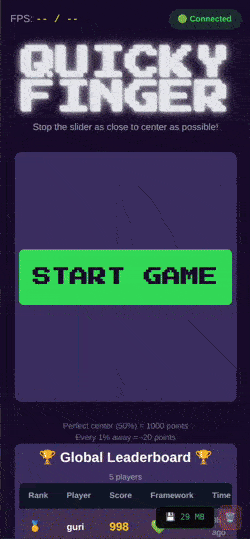

# Quicky Finger - Real-Time Multiplayer Precision Game

A high-performance, real-time multiplayer game built with modern web technologies. Stop the slider as close to center as possible and compete on a global leaderboard!



**Live Demo:** [Quicky Finger](https://quicky-finger.drazenorsolic.xyz/)

---

## Features

- **Instant Play** - No signup required, jump right in
- **Real-Time Multiplayer** - See scores update live across all players
- **60fps Animation** - Smooth gameplay using requestAnimationFrame
- **Visual and audio Feedback** - tension and celebrations for great scores
- **Responsive Design** - Works on desktop, tablet, and mobile
- **Type-Safe** - Full TypeScript implementation
- **Tested** - 60+ tests covering all functionality

---

## Architecture

```
┌─────────────────────────────────────────┐
│         Vue 3 Frontend (Vite)           │
│  ┌────────────────────────────────────┐ │
│  │  Components (Composition API)      │ │
│  │  - SliderGame                      │ │
│  │  - Leaderboard                     │ │
│  │  - NicknameInput                   │ │
│  └────────────────────────────────────┘ │
│  ┌────────────────────────────────────┐ │
│  │  State Management (Pinia)          │ │
│  │  - gameStore                       │ │
│  │  - leaderboardStore                │ │
│  └────────────────────────────────────┘ │
│  ┌────────────────────────────────────┐ │
│  │  Composables                       │ │
│  │  - useWebSocket                    │ │
│  │  - useGameLoop                     │ │
│  └────────────────────────────────────┘ │
└─────────────┬───────────────────────────┘
              │ WebSocket (wss://)
              ▼
┌─────────────────────────────────────────┐
│      Node.js WebSocket Server           │
│  ┌────────────────────────────────────┐ │
│  │  - Real-time score broadcasting    │ │
│  │  - Input validation & sanitization │ │
│  │  - Rate limiting (10 req/10s)      │ │
│  │  - In-memory leaderboard           │ │
│  └────────────────────────────────────┘ │
└─────────────────────────────────────────┘
```

---

## Quick Start

### Prerequisites

- Node.js 20+
- npm or yarn

### Installation

```bash
# Clone the repository
git clone https://github.com/glava11/web-game-demo.git
cd web-game-demo

# Install all dependencies in monorepo
npm install

# ?? 
# # Install frontend dependencies
# cd game-vue
# npm install

# # Install server dependencies
# cd ../ws-server
# npm install
```

### Running Locally

**Terminal 1 - Start Server:**

```bash
# cd ws-server
npm run dev:server
```

**Terminal 2 - Start Frontend:**

```bash
# cd game-vue
npm run dev:vue
```

Open http://localhost:5173 and play!

---

## Testing

```bash
# Run all tests
npm test

# Run with coverage
npm test -- --coverage

# Run specific test suite
npm test integration
npm test performance
```

**Test Coverage:**

- Unit tests: Game logic, scoring, utilities
- Component tests: User interactions, rendering
- Integration tests: WebSocket flow, state management
- Performance tests: 60fps compliance, memory management

---

## Deployment

### Frontend ()

1. set env variable `VITE_WS_URL` (for local: "ws://localhost:8080")

### Backend ()

1. Set environment variable: `PORT=8080`
2. Push code to main on GitHub
3. Go check on [heroku](https://heroku.com)

See [DEPLOYMENT.md](./docs/DEPLOYMENT.md) for detailed instructions.

---

## Tech Stack

### Frontend

- **Vue 3** - Composition API
- **TypeScript** - Type safety
- **Pinia** - State management
- **Vite** - Build tool
- **Tailwind CSS** - Styling
- **Vitest** - Testing
- **canvas-confetti** - Celebrations

### Backend

- **Node.js** - Runtime
- **ws** - WebSocket library
- **TypeScript** - Type safety

### DevOps

- **Web Hosting** - Frontend hosting
- **Heroku** - Backend hosting

---

## Performance

- **Load Time:** < 2s (Lighthouse)
- **Frame Rate:** Consistent 60fps
- **Bundle Size:** < 150KB (gzipped)
- **Time to Interactive:** < 3s
- **WebSocket Latency:** < 50ms average

---

## How to Play

1. **Click Start** - Slider begins moving left to right
2. **Watch Carefully** - Track the slider position
3. **Click STOP!** - Freeze the slider as close to center as possible
4. **See Your Score** - Closer to center = higher score (max 1000)
5. **Enter Nickname** - If you score in top 20, save your score!
6. **Compete** - Try to beat other players on the leaderboard

**Scoring:**

- Perfect center (50%) = 1000 points
- Every 1% away from center = -20 points
- Minimum score = 0 points

---

## Roadmap

### Phase 3: React Port

- [ ] Rebuild game in React
- [ ] Compare patterns (hooks vs composables)
- [ ] Multi-framework leaderboard

### Phase 4: Angular Port

- [ ] Complete the framework trilogy
- [ ] Document comparison insights

### Phase 5: Extending

- [ ] Difficulty levels
- [ ] server saving the leaderboards data (and loading if any, on boot up)

---

## Contributing

This is a personal learning project, but feedback is welcome!

1. Fork the repository
2. Create a feature branch
3. Make your changes
4. Add tests
5. Submit a pull request

---

## License

MIT License - feel free to use this code for learning!

---

## Author

**Drazen**

- Web: [drazenorsolic.xyz](https://drazenorsolic.xyz)

---

## Acknowledgments

- Built as experimentation project
- Inspired by classic arcade games

---

**Built with ❤️ and lots of ☕**
